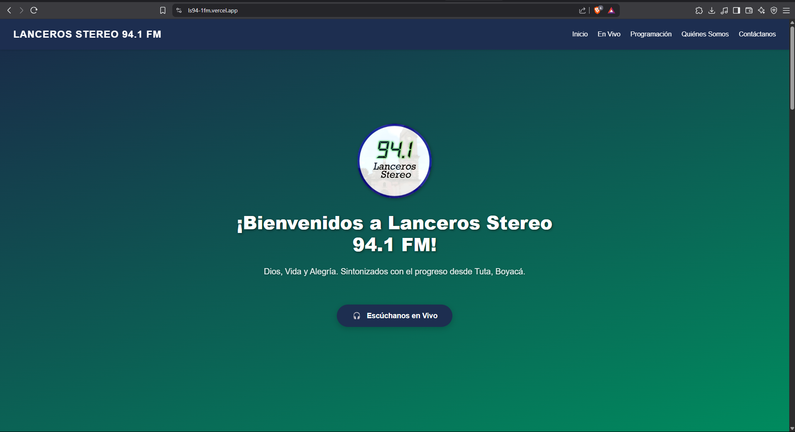

# LS94.1FM – Landing Page Oficial

**LS94.1FM** es una aplicación web de una sola página (SPA) desarrollada con Angular para la emisora Lanceros Stereo 94.1 FM, ubicada en Tuta, Boyacá (Colombia). Esta landing page moderna presenta programación, transmisión en vivo, contacto institucional y presencia digital de la emisora.

🌐 **Sitio en vivo**: [https://ls94-1fm.vercel.app](https://ls94-1fm.vercel.app)  
📁 **Repositorio**: [GitHub - ls94.1fm-landing-page](https://github.com/juanitomanoplateada/ls94.1fm-landing-page)

---

## 📌 Propósito y Alcance

El objetivo de este proyecto es ofrecer una plataforma digital accesible, rápida y adaptable para representar a LS94.1FM en internet, facilitando:

- Información institucional y de programación.
- Enlace a transmisión en vivo.
- Contacto para oyentes y patrocinadores.

---

## 🧩 Arquitectura de la Aplicación

La aplicación sigue una arquitectura Angular estándar basada en componentes independientes (standalone), iniciando desde `index.html` con el componente raíz `<app-root>`.

### Estructura principal

- `index.html`: punto de entrada del HTML.
- `main.ts`: bootstraps del módulo principal.
- `app.ts`: componente raíz (`AppComponent`).
- `app.html`: orquesta los componentes secundarios.

### Componentes UI

- **Header**: navegación y branding.
- **Hero**: bienvenida y llamada a la acción.
- **Live**: acceso a transmisión en vivo.
- **Schedule**: programación radial.
- **AboutUs**: información institucional.
- **Contact**: datos de contacto y localización.
- **Footer**: enlaces legales y sociales.

---

## ⚙️ Stack Tecnológico

| Tecnología | Rol |
|------------|-----|
| Angular CLI | Framework principal |
| SCSS        | Preprocesador de estilos |
| TypeScript  | Lógica de componentes |
| HTML5       | Estructura semántica |
| Vercel      | Despliegue continuo |

---

## 🚀 Instalación y Desarrollo

Clona el proyecto:

```bash
git clone https://github.com/juanitomanoplateada/ls94.1fm-landing-page.git
cd ls94.1fm-landing-page
```

Instala dependencias:

```bash
npm install
```

Para entorno local:

```bash
npm run dev
```

Para producción:

```bash
npm run build
```

---

## 🧪 Desarrollo y Pruebas

- Estructura modular basada en Angular Standalone Components.
- Soporte para SCSS global y por componente.
- Configuración optimizada en `angular.json` para builds de desarrollo y producción.
- Límite de bundle: advertencia > 500kB, error > 1MB.
- Source maps habilitados en desarrollo.

---

## 📝 Licencia

Distribuido bajo licencia [MIT](LICENSE).

---

## 📸 Preview


---

